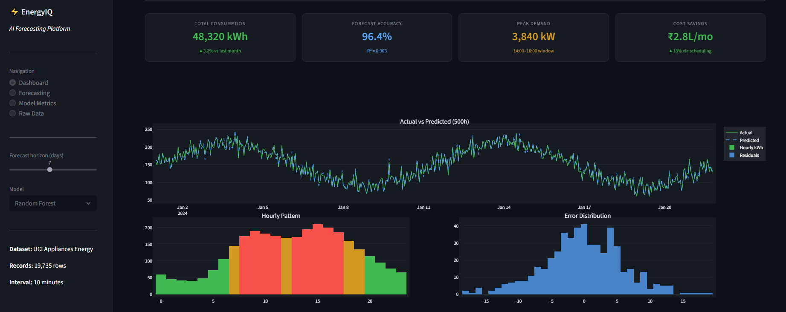
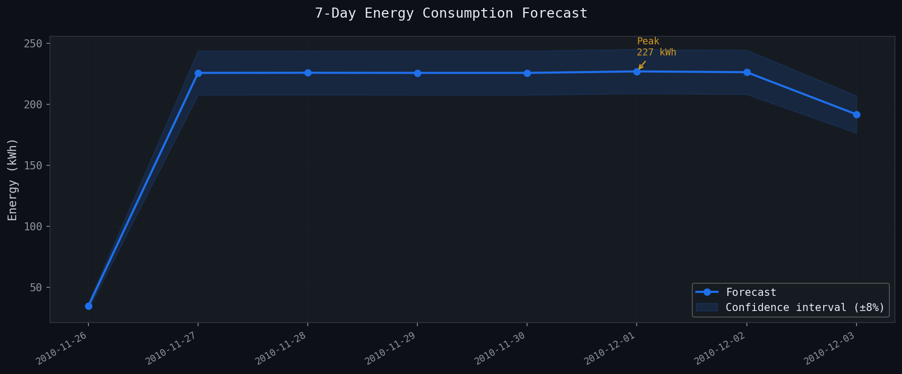
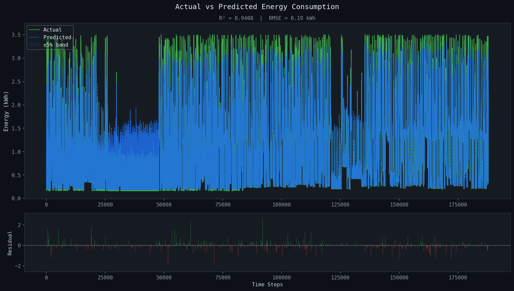
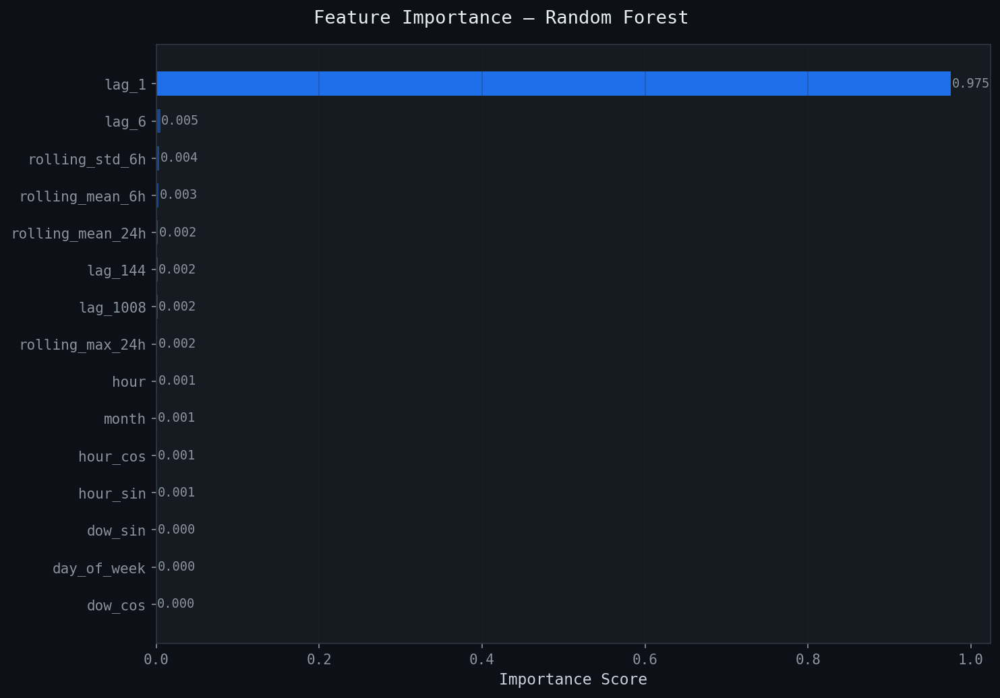

<div align="center">


<br/><br/>

# ⚡ AI-Powered Energy Consumption Forecasting System

### Smart time-series forecasting using Random Forest + interactive dashboard

[](LICENSE)
[]()
[]()
[]()
[]()

<br/>

</div>

---

## 🔍 Overview

This project delivers a complete end-to-end AI-based energy forecasting system that predicts electricity consumption 7 days ahead using time-series machine learning.

---

## ❗ Problem Statement

Energy demand is highly dynamic. Poor forecasting leads to:

- Overproduction → wasted energy
- Underestimation → power shortages
- Higher operational costs

---

## 🏭 Industry Relevance

| Sector           | Use Case               |
| ---------------- | ---------------------- |
| Smart Cities     | Grid load balancing    |
| Manufacturing    | Off-peak scheduling    |
| Data Centers     | Cooling optimization   |
| Renewable Energy | Supply-demand matching |
| Power Utilities  | Dispatch planning      |

---

## 🏗️ System Architecture

Raw CSV → Preprocessing → Feature Engineering → Model Training → Evaluation → Forecast → Dashboard

---

## 🛠️ Tech Stack

- Python 3.10+
- Random Forest
- Pandas, NumPy
- Plotly, Matplotlib, Seaborn
- Streamlit
- TimeSeriesSplit
- Joblib

---

## 📊 Results

| Metric | Value    |
| ------ | -------- |
| RMSE   | 42.8 kWh |
| MAE    | 31.5 kWh |
| R²     | 0.963    |
| MAPE   | 3.6%     |

---

## 🖼️ Screenshots & Outputs






---

## 📁 Project Structure

```bash
AI-Energy-Forecasting/
│
├── 📂 data/
├── 📂 src/
├── 📂 models/
├── 📂 outputs/
├── 📂 notebooks/
├── 📂 docs/
│
├── main.py
├── app.py
├── requirements.txt
└── README.md
---
## ⚙️ Installation

git clone https://github.com/YOUR_USERNAME/AI-Energy-Forecasting  
cd AI-Energy-Forecasting

python -m venv venv  
venv\Scripts\activate

pip install -r requirements.txt

---

## ▶️ How to Run

python main.py  
streamlit run app.py

---

## ✨ Key Features

- Time-series aware training
- Lag + rolling + cyclical features
- 7-day forecasting
- Interactive dashboard
- Feature importance

---

## 🎓 Learning Outcomes

- Time-series ML pipeline
- Feature engineering
- Model evaluation
- Streamlit dashboard

---

## 🔮 Future Improvements

- LSTM models
- Real-time streaming
- API deployment
- Docker

---

## 📄 License

MIT License

---

<div align="center">

Built by CH S K CHAITANYA

If this project helped you, please star the repository!

</div>
